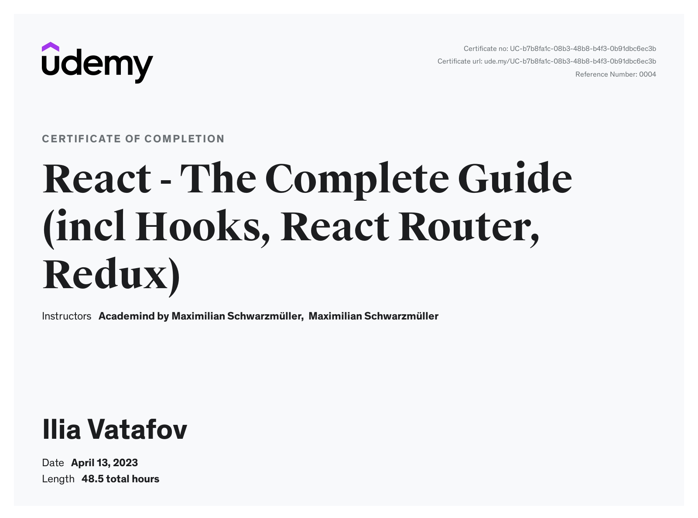

# React - The Complete Guide (incl Hooks, React Router, Redux)

A simple portfolio of training projects developed during a course on Udemy. The course covers in-depth all the basic and advanced concepts in React, including Hooks, the latest version of React Router, Redux, and React Transition Group. You can find details for the course <a href="https://www.udemy.com/share/101Wby3@kKY0DtPzjHQx9k-HJ1msX8fAdW5ScMPFJ2tJFNJ5K4aNFkjJ6zUI3ZE9WlhRw06AxA==/">https://www.udemy.com/share/101Wby3@kKY0DtPzjHQx9k-HJ1msX8fAdW5ScMPFJ2tJFNJ5K4aNFkjJ6zUI3ZE9WlhRw06AxA==/</a>

