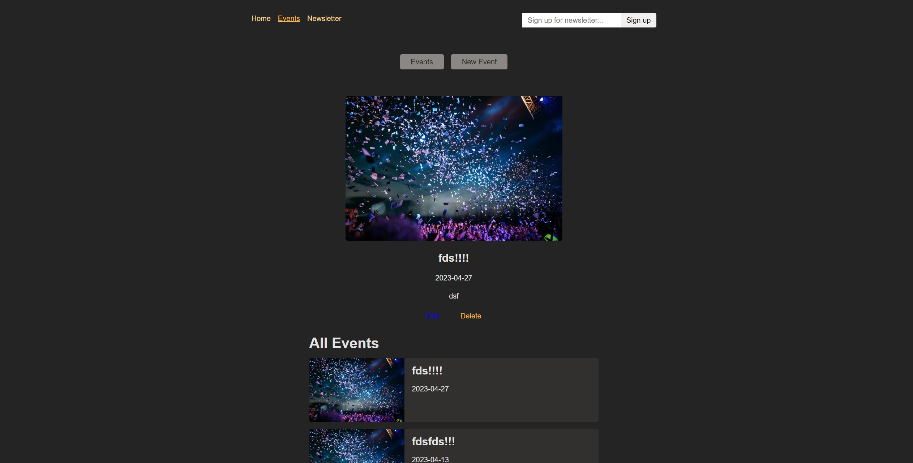

<h1 align="center"><i>Events App</i></h1>

 

 A simple events app, providing users to add, edit and delete events.

<h3 align="center"><i>Screenshots</i></h3>

    

<h3 align="center"><i>Features</i></h3>

The events app includes the following features:

<ul>
    <li>List event</li>
    <li>Detail page</li>
    <li>Create event</li>
    <li>Edit event</li>
    <li>Delete event</li>
</ul>

<h3 align="center"><i>How to run the app</i></h3>

<ol>
    <li>Download the repository content in a ZIP file.</li>
    <li>Open the project in a suitable IDE, such as VS Code.</li>
    <li>Navigate to the project backend folder and run the command "npm install" to install all the dependencies.</li>
    <li>After all dependencies are installed, run the command "npm start" to start the server.</li>
    <li>Open second terminal. Navigate to the project frontend folder and run the command "npm install" to install all the dependencies.</li>
    <li>After all dependencies are installed, run the command "npm start" to start the app.</li>
</ol>
